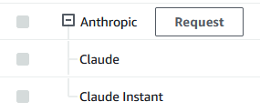

# Configuring the proxy for AWS Bedrock

The proxy supports AWS Bedrock models via the `/proxy/aws/claude` endpoint. There are a few extra steps necessary to use AWS Bedrock compared to the other supported APIs.

- [Setting keys](#setting-keys)
- [Attaching policies](#attaching-policies)
- [Provisioning models](#provisioning-models)
- [Note regarding logging](#note-regarding-logging)

## Setting keys

Use the `AWS_CREDENTIALS` environment variable to set the AWS API keys.

Like other APIs, you can provide multiple keys separated by commas. Each AWS key, however, is a set of credentials including the access key, secret key, and region. These are separated by a colon (`:`).

For example:

```
AWS_CREDENTIALS=AKIA000000000000000:somesecretkey:us-east-1,AKIA111111111111111:anothersecretkey:us-west-2
```

## Attaching policies

Unless your credentials belong to the root account, the principal will need to be granted the following permissions:

- `bedrock:InvokeModel`
- `bedrock:InvokeModelWithResponseStream`
- `bedrock:GetModelInvocationLoggingConfiguration`
  - The proxy needs this to determine whether prompt/response logging is enabled. By default, the proxy won't use credentials unless it can conclusively determine that logging is disabled, for privacy reasons.

Use the IAM console or the AWS CLI to attach these policies to the principal associated with the credentials.

## Provisioning models

AWS does not automatically provide accounts with access to every model. You will need to provision the models you want to use, in the regions you want to use them in. You can do this from the AWS console.

⚠️ **Models are region-specific.** Currently AWS only offers Claude in a small number of regions. Switch to the AWS region you want to use, then go to the models page and request access to **Anthropic / Claude**.



Access is generally granted more or less instantly. Once your account has access, you can enable the model by checking the box next to it.

You can also request Claude Instant, but support for this isn't fully implemented yet.

### Supported model IDs
Users can send these model IDs to the proxy to invoke the corresponding models.
- **Claude**
  - `anthropic.claude-v1` (~18k context, claude 1.3 -- EOL 2024-02-28)
  - `anthropic.claude-v2` (~100k context, claude 2.0)
  - `anthropic.claude-v2:1` (~200k context, claude 2.1)
- **Claude Instant**
  - `anthropic.claude-instant-v1` (~100k context, claude instant 1.2)

## Note regarding logging

By default, the proxy will refuse to use keys if it finds that logging is enabled, or if it doesn't have permission to check logging status.

If you can't attach the `bedrock:GetModelInvocationLoggingConfiguration` policy to the principal, you can set the `ALLOW_AWS_LOGGING` environment variable to `true` to force the proxy to use the keys anyway. A warning will appear on the info page when this is enabled.
