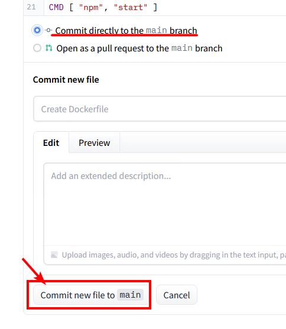

# Deploy to Huggingface Space

**⚠️ This method is no longer recommended.  Please use the [self-hosting instructions](./self-hosting.md) instead.**

This repository can be deployed to a [Huggingface Space](https://huggingface.co/spaces).  This is a free service that allows you to run a simple server in the cloud.  You can use it to safely share your OpenAI API key with a friend.

### 1. Get an API key
- Go to [OpenAI](https://openai.com/) and sign up for an account. You can use a free trial key for this as long as you provide SMS verification.
    - Claude is not publicly available yet, but if you have access to it via the [Anthropic](https://www.anthropic.com/) closed beta, you can also use that key with the proxy.

### 2. Create an empty Huggingface Space
- Go to [Huggingface](https://huggingface.co/) and sign up for an account.
- Once logged in, [create a new Space](https://huggingface.co/new-space).
- Provide a name for your Space and select "Docker" as the SDK.  Select "Blank" for the template.
- Click "Create Space" and wait for the Space to be created.


### 3. Create an empty Dockerfile
- Once your Space is created, you'll see an option to "Create the Dockerfile in your browser".  Click that link.


- Paste the following into the text editor and click "Save".
```dockerfile
FROM node:18-bullseye-slim
RUN apt-get update && \
    apt-get install -y git
RUN git clone https://gitgud.io/khanon/oai-reverse-proxy.git /app
WORKDIR /app
RUN chown -R 1000:1000 /app
USER 1000
RUN npm install
COPY Dockerfile greeting.md* .env* ./
RUN npm run build
EXPOSE 7860
ENV NODE_ENV=production
ENV NODE_OPTIONS="--max-old-space-size=12882"
CMD [ "npm", "start" ]
```
- Click "Commit new file to `main`" to save the Dockerfile.



### 4. Set your API key as a secret
- Click the Settings button in the top right corner of your repository.
- Scroll down to the `Repository Secrets` section and click `New Secret`.


- Enter `OPENAI_KEY` as the name and your OpenAI API key as the value.
    - For Claude, set `ANTHROPIC_KEY` instead.
    - You can use both types of keys at the same time if you want.


### 5. Deploy the server
- Your server should automatically deploy when you add the secret, but if not you can select `Factory Reboot` from that same Settings menu.

### 6. Share the link
- The Service Info section below should show the URL for your server. You can share this with anyone to safely give them access to your API key.
- Your friend doesn't need any API key of their own, they just need your link.

# Optional

## Updating the server

To update your server, go to the Settings menu and select `Factory Reboot`.  This will pull the latest version of the code from GitHub and restart the server.

Note that if you just perform a regular Restart, the server will be restarted with the same code that was running before.

## Adding a greeting message

You can create a Markdown file called `greeting.md` to display a message on the Server Info page.  This is a good place to put instructions for how to use the server.

## Customizing the server

The server will be started with some default configuration, but you can override it by adding a `.env` file to your Space.  You can use Huggingface's web editor to create a new `.env` file alongside your Dockerfile. Huggingface will restart your server automatically when you save the file.

Here are some example settings:
```shell
# Requests per minute per IP address
MODEL_RATE_LIMIT=4
# Max tokens to request from OpenAI
MAX_OUTPUT_TOKENS_OPENAI=256
# Max tokens to request from Anthropic (Claude)
MAX_OUTPUT_TOKENS_ANTHROPIC=512
# Block prompts containing disallowed characters
REJECT_DISALLOWED=false
REJECT_MESSAGE="This content violates /aicg/'s acceptable use policy."
```

See `.env.example` for a full list of available settings, or check `config.ts` for details on what each setting does.

## Restricting access to the server

If you want to restrict access to the server, you can set a `PROXY_KEY` secret.  This key will need to be passed in the Authentication header of every request to the server, just like an OpenAI API key.  Set the `GATEKEEPER` mode to `proxy_key`, and then set the `PROXY_KEY` variable to whatever password you want.

Add this using the same method as the OPENAI_KEY secret above. Don't add this to your `.env` file because that file is public and anyone can see it.

Example:
```
GATEKEEPER=proxy_key
PROXY_KEY=your_secret_password
```
