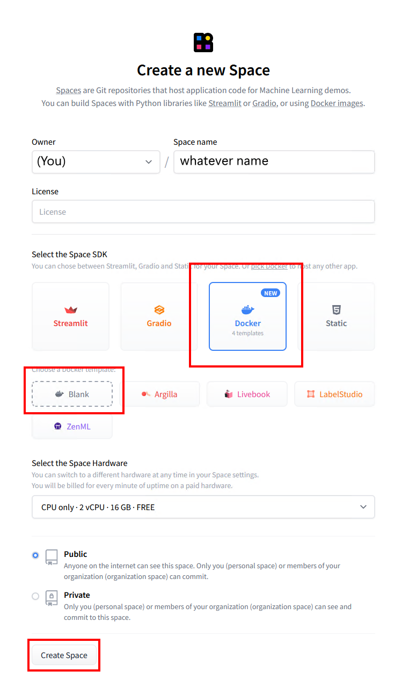
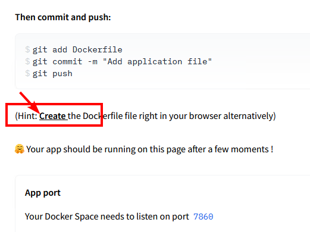

# Deploy to Huggingface Space

This repository can be deployed to a [Huggingface Space](https://huggingface.co/spaces).  This is a free service that allows you to run a simple server in the cloud.  You can use it to safely share your OpenAI API key with a friend.

### 1. Get an API key
- Go to [OpenAI](https://openai.com/) and sign up for an account. You can use a free trial key for this as long as you provide SMS verification.

### 2. Create an empty Huggingface Space
- Go to [Huggingface](https://huggingface.co/) and sign up for an account.
- Once logged in, [create a new Space](https://huggingface.co/new-space).
- Provide a name for your Space and select "Docker" as the SDK.  Select "Blank" for the template.
- Click "Create Space" and wait for the Space to be created.



### 3. Create an empty Dockerfile
- Once your space is created, you'll see an option to "Create the Dockerfile in your browser".  Click that link.


- Paste the following into the text editor and click "Save".
```dockerfile
FROM node:18-bullseye-slim
RUN apt-get update && \
    apt-get install -y git
RUN git clone https://github.com/nai-degen/oai-reverse-proxy.git /app
WORKDIR /app
COPY package*.json ./
RUN npm install
COPY . .
RUN npm run build
EXPOSE 7860
CMD [ "npm", "start" ]
```
- Click "Commit new file to `main`" to save the Dockerfile.


### 4. Set your OpenAI API key as a secret
- Click the Settings button in the top right corner of your repository.
- Scroll down to the `Repository Secrets` section and click `New Secret`.


- Enter `OPENAI_KEY` as the name and your OpenAI API key as the value.


### 5. Deploy the server
- Your server should automatically deploy when you add the secret, but if not you can select `Factory Reboot` from that same Settings menu.

### 6. Share the link
- The Service Info section below should show the URL for your server. You can share this with anyone to safely give them access to your OpenAI API key.
- Your friend doesn't need any OpenAI API key of their own, they just need your link.
- However, if you want to protect access to the server, you can add another secret called `PROXY_KEY`.  This key will need to be passed in the Authentication header of every request to the server, just like an OpenAI API key.


